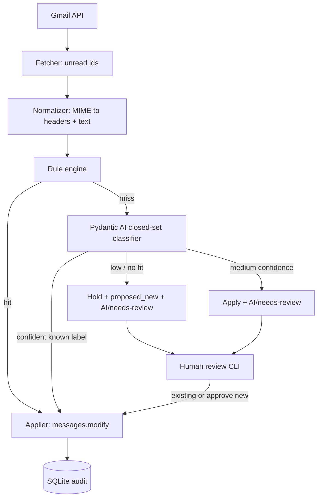

# Design document

Status: **Phase 0–3 on main; Phase 4+5 operator stack in progress; Phase 6 hosted SaaS is the customer product**  
Related: [PLAN.md](PLAN.md), [DECISIONS.md](DECISIONS.md), [PRIVACY.md](PRIVACY.md), [OPS.md](OPS.md), [PRODUCT.md](PRODUCT.md), [PHASE6.md](PHASE6.md)

## 1. Goals

1. **Product:** reliably label unread Gmail into a managed taxonomy with a human gate for new categories.
2. **Trust:** label-only under `AI/`; never mark read; never archive.
3. **Unit economics:** rules catch repetitive mail; LLM handles the long tail.
4. **Learning path:** structured output → evals → RAG → MCP/API without rewriting the core.

Non-goals for early phases: LangGraph, empty stub modules. Phase 4 adds MCP + local
incremental sync; Phase 5 adds FastAPI + dashboard foundation. Phase 6 is **hosted
SaaS as the only customer surface** (see [PHASE6.md](PHASE6.md)).

## 2. High-level architecture



### Layering

| Layer | Responsibility |
|-------|----------------|
| `cli.py` | Typer/Rich I/O only |
| `services/` | Sync + review business logic (future MCP/FastAPI call the same functions) |
| `classify/` | Rules, agent, routing |
| `gmail/` | Auth, API client, parser, `GmailGateway` protocol + `FakeGmail` |
| `taxonomy/` | Seed + registry ↔ Gmail labels |
| `review/` | Queues, display sanitization, existing-label suggestions |
| `db/` | SQLModel schema + SQLite |

## 3. Core contracts

### Classification

```python
class NewCategory(BaseModel):
    suggested_key: str      # kebab-case, not a placeholder
    description: str        # prompt disambiguation line
    why_no_existing_fit: str

class Classification(BaseModel):
    label_key: str | None   # closed set built from active taxonomy at runtime
    confidence: float | None
    rationale: str
    proposed_new: NewCategory | None  # required when label_key is None
```

- Closed-set `label_key` is a dynamically built `Literal` so the model cannot invent labels on the normal path.
- New categories are an **explicit** field, not a prompt instruction.

### Routing

| Condition | Route | Gmail effect (`--apply`) |
|-----------|-------|---------------------------|
| Rule match | `apply` | Add `AI/<key>`; confidence stored `NULL` |
| `label_key` + conf ≥ apply (0.75) | `apply` | Add `AI/<key>` |
| `label_key` + conf ∈ [review, apply) | `apply_with_review` | Add `AI/<key>` + `AI/needs-review` |
| `label_key is None` or conf \< review | `hold_propose` | Add `AI/needs-review`; store `proposed_*` |

## 4. Data model (SQLite)

| Table | Role |
|-------|------|
| `categories` | Taxonomy: `active` / `proposed` / `rejected`, Gmail label id, exemplars |
| `messages` | One row per Gmail id; `state`, applied label ids, payload snapshot |
| `classifications` | Decisions: `predicted_key`, `final_key`, `confidence`, `source`, `proposed_*`, model, `prompt_version` |
| `proposals` | Deduped new-category queue |
| `negative_examples` | User removed label → never re-apply that key to that message |
| `runs` | Sync run counts + dry-run flag |

Message states: `pending`, `labeled`, `held`, `needs_review`, `skipped`, `user_removed`.

Lightweight SQLite `ALTER TABLE` migrations run on `init_db` for additive columns (e.g. `proposed_key`).

## 5. Gmail integration

- Scopes: `gmail.modify`, `gmail.labels` only.
- Labels nested under configurable parent (`AI` by default).
- `GmailGateway` protocol enables `FakeGmail` + JSON fixtures in tests — no credentials in CI.
- Retries with exponential backoff on 429/5xx (`tenacity`).
- Batch-friendly APIs reserved for later backfills (`batchModify`).

### Normalization / privacy shaping

Payload to rules/LLM includes:

- From, To, Subject, Date, List-Unsubscribe
- Plaintext body (HTML→text fallback), truncated to `body_char_limit` (default 2000) from the end
- Attachment **filenames** only
- Digit runs of length ≥ 9 replaced with `[REDACTED]`

## 6. Rules engine

- Builtin YAML shipped in-package.
- User YAML at config dir overlays by `name` (user wins).
- Identical schema; validated at startup against active taxonomy keys (fail loud on stale keys).
- Rule hits bypass LLM; never open proposals; `confidence=NULL`.

## 7. Review UX design

Two Gmail-visible concepts map to three CLI queues:

1. Medium-confidence → `needs_review` state + confirm/change/propose-new  
2. Holds → `held` state (also tagged `AI/needs-review` for inbox visibility)  
3. Proposals → approve/rename new taxonomy keys  

Held review shows:

- Heuristic **existing-label suggestion** (subject/rationale cues)
- Persisted **LLM `proposed_new`** when no confident existing fit

Existing labels are chosen by **numeric index** (or exact key).

## 8. Idempotency & reprocess

- Primary key: Gmail message id in SQLite.
- Default sync skips terminal states (`labeled`, `held`, `needs_review`, …).
- `--reprocess` forces classification again (LLM cost).
- If the user deletes an applied Tagsmith label in Gmail, sync records a negative example and will not re-apply that key.

Dry-run does **not** create a separate “pending apply” queue; `--apply` means “this run may write to Gmail.”

## 9. Future seams (intentional, no stubs)

1. `classify_email(..., examples: list[LabeledEmail] | None = None)` — Phase 3 RAG injects few-shots here.  
2. All mutations/queries go through `services/` — Phase 4 MCP and Phase 5 FastAPI wrap the same API.

## 10. Testing strategy

- Real-shaped Gmail `messages.get` JSON fixtures (payment, security, OTP, newsletter, HTML-only, attachment).
- `FakeGmail` in-memory gateway.
- Pydantic AI calls stubbed in unit tests (no network).
- CI: ruff, format, mypy, pytest (3.11/3.12), Gitleaks, pip-audit, Bandit.

## 11. Configuration

`pydantic-settings` with `TAGSMITH_` prefix + `.env`.  
Provider keys (`OPENROUTER_API_KEY`, etc.) are loaded into `os.environ` via `load_dotenv()` so Pydantic AI can see them.

## 12. Risks & mitigations

| Risk | Mitigation |
|------|------------|
| Restricted Gmail scope | Stick to modify + labels |
| LLM invents labels | Closed-set + explicit `proposed_new` |
| Proposal spam / dedupe orphans | Per-message `proposed_*` on classifications; held list is per-message |
| Re-adding user-deleted labels | Negative examples |
| Privacy | Truncation, redaction, no attachment bodies, local tokens |
| Uncalibrated confidence | Log it; rules use NULL; Phase 2 tunes thresholds from golden set |
