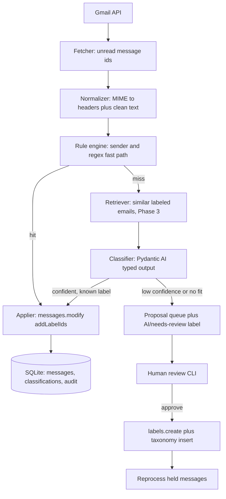

# Tagsmith

Repo and package name: `tagsmith`. CLI entry point: `tagsmith`.

> **Implemented docs for operators/contributors:** [README.md](README.md) (index), [SETUP.md](SETUP.md), [USAGE.md](USAGE.md), [DESIGN.md](DESIGN.md), [PRIVACY.md](PRIVACY.md), [CONTRIBUTING.md](CONTRIBUTING.md), [DECISIONS.md](DECISIONS.md).
>
> This PLAN remains the long-horizon product + learning roadmap.

## Goal

A Python service that walks unread Gmail, classifies each message into a managed taxonomy (`payment-sent`, `login-detected`, ...), applies the Gmail label, and when nothing fits, files a **category proposal** for human approval. On approval the label is created in Gmail and the taxonomy grows.

Two objectives held at once: a sellable product, and a hands-on path through LLM structured output, evals, RAG, and MCP. The phasing below is ordered so each phase teaches one concept and leaves working software behind.

## Recommended stack

- **Orchestration/classifier**: [Pydantic AI](https://ai.pydantic.dev) — typed outputs via Pydantic schemas, model-agnostic (OpenAI/Anthropic/Gemini/Ollama), `TestModel`/`FunctionModel` for tests without API calls. Right fit because the core problem is *reliable structured output*, not multi-agent orchestration.
- **Gmail**: `google-api-python-client` + `google-auth-oauthlib`, scopes `gmail.modify` (read + apply labels) and `gmail.labels` (create). Deliberately **not** `https://mail.google.com/` — that is a restricted scope requiring a paid annual CASA Tier 2 assessment, while `gmail.modify` is only *sensitive* (free Google review).
- **CLI**: Typer + Rich. **Storage**: SQLite via SQLAlchemy/SQLModel (swap to Postgres later). **Config**: pydantic-settings. **Retries**: tenacity.
- **Later**: LanceDB or Chroma (Phase 3 RAG), `mcp` Python SDK / FastMCP (Phase 4), FastAPI + Postgres/pgvector + Next.js (Phase 5).
- **Deferred on purpose**: LangGraph. Bring it in only when the approval loop needs durable pause/resume across restarts; for a batch job with a DB-backed queue it is unnecessary weight.

## Architecture



Design decisions worth calling out:

- **Closed-set classification.** The allowed `label_key` values are a dynamically built `Literal`/enum from the active taxonomy, so the model physically cannot invent a label in the normal path. New categories are a *separate, explicit* field (`proposed_new`) — this is what makes the approval gate reliable rather than a prompt instruction the model may ignore.
- **Nested labels.** Everything lands under a parent, e.g. `AI/payment-sent`, plus `AI/needs-review`. One click in Gmail undoes the agent's entire footprint, which matters enormously for user trust in a paid product.
- **Rules before LLM.** A deterministic sender/subject-pattern layer catches the repetitive 60–80% of a real inbox (bank alerts, GitHub, Google security) at zero cost and zero latency. The LLM handles the tail. This is the difference between a viable unit economic and an unsellable one.
- **Dry-run by default.** `--apply` is opt-in. Nothing touches a mailbox until explicitly asked.
- **Idempotency.** Every decision is keyed by Gmail message id in SQLite; re-runs never double-apply or re-bill.

## Repository layout

```
tagsmith/
  pyproject.toml           # uv/hatch, ruff, mypy, pytest config
  .env.example             # GOOGLE_CLIENT_SECRET_PATH, LLM_PROVIDER, LLM_API_KEY, ...
  README.md                # setup: GCP project, OAuth client, first run
  src/tagsmith/
    config.py              # pydantic-settings Settings
    cli.py                 # typer: auth, sync, review, taxonomy, eval
    gmail/
      auth.py              # InstalledAppFlow, token.json refresh
      client.py            # list/get/modify/batchModify/labels + backoff
      parser.py            # MIME walk, base64url decode, HTML strip, truncate
    taxonomy/
      registry.py          # category CRUD, reconcile local taxonomy <-> Gmail labels
      seed.yaml            # starting categories: key, description, 2 exemplars
    classify/
      schema.py            # Classification, NewCategory pydantic models
      rules.py             # deterministic fast path
      agent.py             # Pydantic AI agent + prompt assembly
      pipeline.py          # rules -> llm -> threshold routing -> apply
    review/
      queue.py             # proposal dedupe, approve/reject, requeue held msgs
    db/models.py, db/session.py
    telemetry.py           # structlog + optional Logfire tracing
  tests/                   # fixtures of real-shaped emails, TestModel-based tests
  evals/golden_set.jsonl   # hand-labeled emails, the ground truth
  evals/run_eval.py
```

## Core contract

```python
class NewCategory(BaseModel):
    suggested_key: str        # kebab-case, e.g. "insurance-renewal"
    description: str          # one line, becomes taxonomy doc + future prompt context
    why_no_existing_fit: str

class Classification(BaseModel):
    label_key: LabelKey | None    # Literal built from active taxonomy at runtime
    confidence: float             # 0..1
    rationale: str                # one sentence, stored for audit + debugging
    proposed_new: NewCategory | None
```

Routing thresholds (configurable): `>= 0.75` apply; `0.5–0.75` apply plus `AI/needs-review`; `< 0.5` or `label_key is None` hold and open a proposal.

## Data model (SQLite)

- `categories(key, gmail_label_id, description, exemplars, status, created_at)` — status is `active | proposed | rejected`.
- `messages(gmail_id, thread_id, sender, subject, received_at, body_hash, state)`.
- `classifications(id, gmail_id, label_key, confidence, rationale, source, model, prompt_version, tokens, applied_at)` — `source` is `rule | llm | rag`, and `prompt_version` is what lets you compare eval runs across prompt changes.
- `proposals(id, gmail_id, suggested_key, description, rationale, status, decided_at)`.
- `runs(id, started_at, counts_json, cost_estimate)`.

## Phases

**Phase 0 — Foundations.** GCP project, OAuth desktop client, token storage. CLI `auth`, `labels list`, `fetch --unread --limit N` printing normalized emails. Proves the Gmail plumbing before any AI is involved.

**Phase 1 — The skeleton you asked for.** Seed taxonomy, rule engine, Pydantic AI classifier with the schema above, threshold routing, label creation and application, SQLite persistence, and `tagsmith review` for approving new categories. End state: `tagsmith sync --apply` labels a real inbox and queues proposals.

Seed categories: `payment-sent`, `payment-received`, `bill-due`, `subscription-renewal`, `security-alert`, `otp-verification`, `order-confirmation`, `shipping-update`, `travel-booking`, `newsletter`, `promotion`, `job-application`, `support-ticket`, `account-statement`, `tax-document`, `refund`.

**Phase 2 — Evals and observability (do not skip).** Hand-label 100–200 emails into `evals/golden_set.jsonl`. `run_eval.py` reports per-label precision/recall, LLM-routing rate, proposal rate, cost per email, p50/p95 latency. Add Logfire/OpenTelemetry tracing. This is the phase that converts a demo into something defensible — and it is the honest prerequisite for claiming RAG helped.

**Phase 3 — RAG.** Embed normalized emails, store vectors, and retrieve the k=5 most similar *previously labeled* emails as dynamic few-shot examples in the prompt. Also retrieve category descriptions for disambiguation. Measure against the Phase 2 baseline: this is the cleanest possible RAG lesson because you can prove the lift numerically.

**Phase 4 — Continuous operation and MCP.** Incremental sync with `users.history.list` from a stored `historyId`; then Pub/Sub push via `users.watch` (expires weekly, must be renewed). Scheduler for periodic runs. An MCP server exposing `list_unread`, `classify_message`, `apply_label`, `propose_category`, `approve_proposal` so Cursor/Claude can drive the mailbox conversationally.

**Phase 5 — Product.** FastAPI backend with web OAuth, Postgres + pgvector, per-tenant encrypted refresh tokens, a Next.js dashboard where review/approval actually lives, billing, and Google OAuth sensitive-scope verification (free, ~2–4 weeks, requires a privacy policy, domain verification, and a demo video).

## Risks

- **Privacy is the product risk, not a footnote.** Email bodies are among the most sensitive data a user has. For the SaaS version: zero-retention settings with the LLM provider, store hashes and embeddings rather than raw bodies, and publish a plain-language data policy. Get this right early — it is also what enterprise buyers will ask about first.
- **Scope discipline.** Adding `https://mail.google.com/` at any point converts a free review into a paid annual security assessment. Keep to `gmail.modify` + `gmail.labels`.
- **Product naming.** Google rejects OAuth consent-screen names containing their product names, so the app name stays `Tagsmith`. "Gmail" may appear only descriptively in a tagline, which Google's guidance permits (it lists "PDF Viewer for Google Drive" as acceptable).
- **Proposal spam.** Without dedupe, one unusual sender produces a dozen near-identical proposals. Fuzzy-match plus embedding-cluster pending proposals before showing them for review.
- **Quota.** 250 units/user/second; `messages.get` is 5 units. Backfills should use `batchModify` and exponential backoff on 429/5xx.

## Open questions (resolved in DECISIONS.md)

1. **LLM provider and cost ceiling** — resolved: Pydantic AI model string, default small hosted model.
2. **v1 shape** — local CLI, SQLite, desktop OAuth.
3. **Where approvals happen** — CLI in Phase 1.
4. **One label per email or several?** — exactly one primary label.

## Task checklist

- [x] **Phase 0 — Foundations**: scaffold repo (pyproject, ruff/mypy/pytest, config), GCP OAuth desktop client, token storage, Gmail client wrapper with retries, MIME normalizer, CLI commands `auth` / `labels list` / `fetch`.
- [x] **Phase 1a — Taxonomy and rules**: seed taxonomy YAML, SQLite schema, registry that reconciles local categories with Gmail labels, deterministic rule engine for the sender/subject fast path.
- [x] **Phase 1b — Classifier**: Pydantic AI agent with `Classification`/`NewCategory` schemas, dynamic `Literal` label set, prompt assembly, confidence-threshold routing.
- [x] **Phase 1c — Apply and review**: label applier (`labels.create` + `messages.modify`, dry-run default, idempotent), proposal queue with dedupe, `tagsmith review` approve/reject flow that creates labels and reprocesses held messages.
- [x] **Phase 2 — Evals**: hand-labeled golden set (seed in `evals/golden_set.jsonl`; grow to 100–200), eval harness (`evals/run_eval.py` / `tagsmith eval`) reporting per-label precision/recall, LLM-routing rate, cost and latency, plus Logfire/OTel tracing (`TAGSMITH_ENABLE_LOGFIRE`). Live baseline ~0.972 on DeepSeek.
- [x] **Phase 3 — RAG**: embed labeled emails into a vector store, retrieve k nearest as dynamic few-shot examples, measure lift against the Phase 2 baseline (`docs/RAG.md`; live leave-one-out **0.982** vs Phase 2 **0.972** — merged to `main`).
- [ ] **Phase 4 — Continuous operation and MCP**: incremental sync via the history API, Pub/Sub watch with renewal, scheduler, and an MCP server exposing the agent's tools (`docs/OPS.md`, branch `feature/phase-4-5-ops-product`).
- [ ] **Phase 5 — Product**: FastAPI + web OAuth, Postgres/pgvector, encrypted per-tenant tokens, review dashboard, billing, Google sensitive-scope verification (`docs/PRODUCT.md`, same branch).
